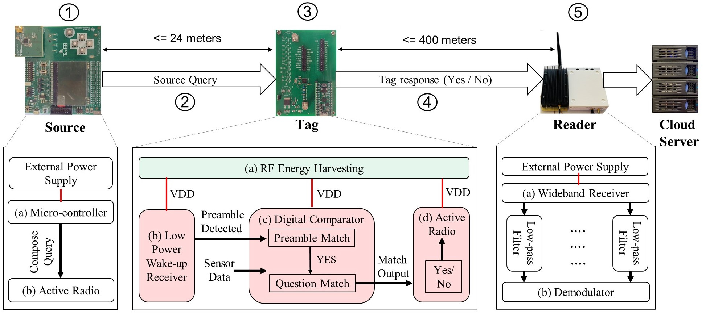

## PACT : Scalable, Long-Range Communication for Monitoring and Tracking Systems Using Battery-less Tags
## Abstract

There is a growing need for low-cost or no-cost monitoring and tracking systems in applications such as Smarter Food and Drug Safety. While backscatter-based communication offers the promise of battery-less tags, it does so at the cost of reduced communication range. In this work, we propose PACT - a scalable communication system that leverages the knowledge asymmetry in the network to improve the communication range of the tags. PACT Tags are battery-less and uses an active radio to communicate over long distances; the Tags operate only on the energy harvested from the PACT Source. A wide-band Reader receives multiple Tag responses concurrently and uploads them to a cloud server, enabling real-time monitoring and tracking. We identify and address the challenges in the practical design of battery-less PACT Tags with active radio and prototype them using off-the-shelf components. We show experimentally that our Tag consumes only 23 muJ energy, which is harvested from an excitation Source that is up to 24 meters away from the Tag. We show that in outdoor deployments, the responses from an estimated 520 Tags can be received by a Reader concurrently while being 400 meters away from the Tags.

## System Design

PACT system design consists of a Source, Tag and Reader. (1) Source uses (b) Active radio to send query to the Tag. (2) Source query asks a specific question to the Tag. (3) Tag harvests energy using this query and responds back with a simple Yes/No reply using an (d) active radio. (4) This response is then received by the (5) Reader and is uploaded to the cloud server.  
In our implementation, we have use CC1125 development kit as Source. Tag is a custom built PCB with 12 stage energy harvesting circuit, Lattice Semiconductor's iCE40LX FPGA and AX5043 as active radio. USRPB200 is used as the Reader to receive Tag response.

## Hardware and Software
* Sotware codes for Source can be found in [Source](Source) folder.
* The PCB design of PACT Tag can be found in [Tag Harware](Tag/Hardware) folder.
* Software codes for Tag can be found in [Tag Software](Tag/Software) folder.
* Software files for Reader implementation can be [Reader](Reader) folder.

## Contact
* Yaman Sangar : [sangar@wisc.edu](mailto:sangar.wisc.edu)
* Yoganand Biradavolu : [ybiradavolu@wisc.edu](ybiradavolu@wisc.edu)