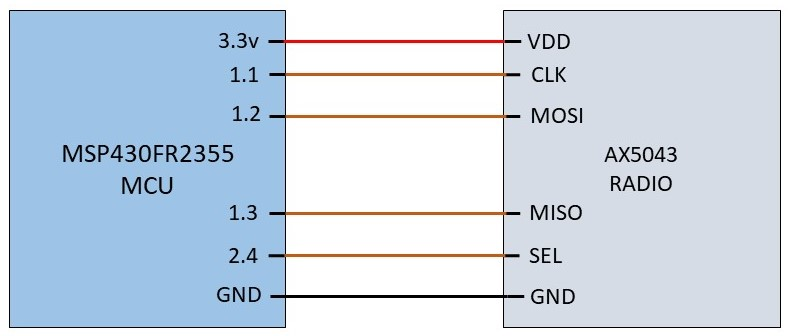

## Tag connections uisng MSP430FR2355

MSP430FR2355 microcontroller and AX5043 radio uses SPI protocol for interfacing. Connections between MSP430FR2355 microcontroller and AX5043 radio are as follows:

* Code for controlling AX5043 radio using MSP430 can be found in AX5043 Radio Code folder.